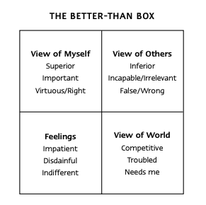
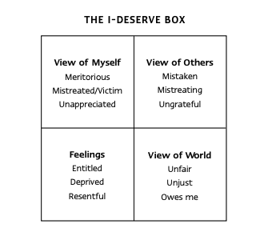

# Introduction

- The strategy for helping others can be thought of as a pyramid
- The tip is dealing with the things that go wrong.
- The vast majority is helping things move in the right direction, and that's where we should be focusing most of our time.

- We should be viewing the person we're interacting with to be the same as we regard ourselves, as people and not as objects.

# Heart of Conflict

- By having a disagreeable heart, we're inviting the very same conflict we've put ourselves in. We should look from the other person's shoes.

In this example, Hannah is nagging to cut the front lawn, Avi complies with due to her nagging even though he has plans at that time.

> Conflict plays off both parties and is a form of collusion to sustain the conflict, even if no words are said. Non-verbal queues and actions can lead to the other party's interpretation of conflict and the cycle continues

- We should actively look for opportunities to humanize people, understanding where they're coming from. By seeing people less as objects and more as people with issues, can make mistakes, etc., the more we can reach a resolution.

# Types of Conflict

There are four main types of justifications over betraying ourselves. Different types of boxes we put ourselves into:

1. The better than box (Superiority over others)
2. I deserve box (Entitlement on what others are getting)
3. Need to be seen as box (Can be conflict avoidance to preserve our self-image)
4. Worse-than box (Justifying others instead with our personal conflicts)

#### Better Than Box

#### I Deserve Box

#### Need To Be Seen As Box

#### Worse Than Box

In the event of overwhelming choices, like helping someone, by having our heart at peace, we still have the choice to make but additional things need to happen to bring that to fruition, we still start and end with the desire to help, and not betray ourselves.

We have many things that would be ideal to do at any given moment. Whether or not we perform it,  we know if we've betrayed ourselves by seeing whether we're still desiring to commit (Like the previous point in the desire to help someone)

People don't change, but we can invite them to change once we get out of our boxes, we invite the same to others.

# Recovering Inner Clarity and Peace

To get out of our boxes, we need to;

- Look for box-like behavior
- Find out-of-box places, e.g: relationships, memories, activities, people we look up to, etc.
- Ponder the situation anew, by answering out of the box questions like
  - What are this person’s trials, burdens, and pains?
  - How am I or some group of which I am a part, adding to these challenges, trials, burdens, and pains?
  - In what other ways have I or my group neglected or mistreated this person or group?
  - In what ways are my better-than, I-deserve, worse-than, and need-to-be-seen-as boxes obscuring the truth about others and myself and interfering with potential solutions? What am I feeling I should do for this person or group?
  - What could I do to help?
- Act upon what we have discovered; do what we are feeling we should do.

# Complete Influence Pyramid

The full influence pyramid is
- Correcting the things that are going wrong
- Teaching and communicating
- Listening and learning
- Building the relationship
- Building the relationship with others who have influence (To get a better understanding of where they're coming from)
- Get out of the box and obtain a heart of peace
