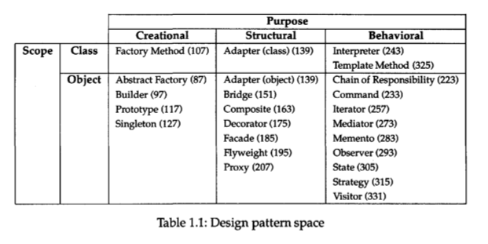
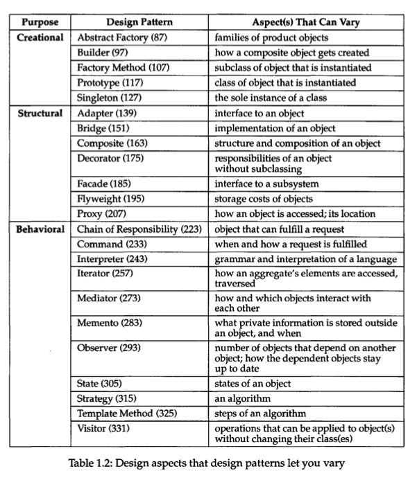

## Design Patterns
## Elements of Reusable Object-Oriented Software

# Table of Contents

- [Introduction](#introduction)

- <details>
    <summary>Creational Patterns</summary>

    - [Abstract Factory](#abstract-factory)
    - [Builder](#builder)
    - [Factory Method](#factory-method)
    - [Prototype](#prototype)
    - [Singleton](#singleton)
  </details>
  <details>
    <summary>Structural Patterns</summary>

    - [Adapter](#adapter)
    - [Bridge](#bridge)
    - [Composite](#composite)
    - [Decorator](#decorator)
    - [Facade](#facade)
    - [Flyweight](#flyweight)
    - [Proxy](#proxy)
  </details>
  <details>
    <summary>Behavioral Patterns</summary>

    - [Chain of Responsibility](#chain-of-responsibility)
    - [Command](#command)
    - [Interpreter](#interpreter)
    - [Iterator](#iterator)
    - [Mediator](#mediator)
    - [Memento](#memento)
    - [Observer](#observer)
    - [State](#state)
    - [Strategy](#strategy)
    - [Template Method](#template-method)
    - [Visitor](#visitor)
  </details>

## Introduction
The following table is how the patterns are classified and which scope they apply to. i.e. Classes or Objects.


Classes have relationships through inheritance, which are therefore static and fixed at compile-time.
Object relationships are more dynamic and can be changed during run-time.

Most patterns aren't found during early stages of design, and found over time as more apparant relationships emerge. The key is flexibility.


## Object Interfaces

Every operation in an object specifies the operation name, the objects it takes as params, and its return value. This is known as an operation's **signature**. A set of all signatures defined by an object's operations is called the interface.

### Dynamic Binding

> Dynamic-binding refers to the run-time assocation of a request to an object that executes different implemetatations of operations depending on the receiving object. Also known as late-binding.

By dynamic binding, we can subsitute objects with similar interfaces for each other during runtime, known as polymorphism.

### Abstract Class

> Abstract classes define a common interface for subclasses and defer some or all of its implementation to subclasses. This means abstract classes can't be instantiated.

> Non-abstract classes are called concrete classes.

## Inheritance versus Composition

Class inheritance is defined statically at compile-time and is supported in most languages. This makes it easier to modify the implementation being reused. When a subclass overrides some but not all operations, it can affect the operations it inherits as well. But it comes with disadvantages, such as being unable to change implementations inherited from parent classes at run-time, as the inheritance is defined at compile-time. Another downside is that parent classes often define at least part of their subclass's physical representation.

Because inheritance exposes a subclass to details of its parent's implementation, it's often said that "inheritance breaks encapsulation". 

Object composition is defined dynamically at run-time through objects acquiring refer- ences to other objects. Composition requires objects to respect each others' interfaces, which in turn requires carefully designed interfaces that don't stop you from using one object with many others. But there is a payoff. Because objects are accessed solely through their interfaces, we don't break encapsulation. 

Object composition has another effect on system design. Favoring object composition over class inheritance helps you keep each class encapsulated and focused on one task. Your classes and class hierarchies will remain small and will be less likely to grow into unmanageable monsters. On the other hand, a design based on object composition will have more objects (if fewer classes), and the system's behavior will depend on their interrelationships instead of being defined in one class.  

> Favor object composition over class inheritance.

## Delegation

Delegation are when a receiving object delegates a request operations to its **delegate**. This is similar to subclasses deferring requests to parent classes. E.g. Instead of a Window class inheriting Rectangle because they're similar in shape, we can keep an instance variable of Rectangle and *delegate* Rectangle-specific behavior to our Rectangle instance variable.

The Window class must forward requests explicitly instead of inheriting those operations.

## Inheritance versus Parameterized Types

Parameterized types give us a third way (in addition to class inheritance and object composition) to compose behavior in object-oriented systems.

Examples of Parameterized Types Patterns are the Template Method, Strategy, or an argument that specifies the name of the function to call and compare the elements.

Inheritance nor parameterized types are unable to change at run-time.

## Common Causes for Redesign

Design patterns are long term solutions on how systems are developed. Systems should take into account how it evolves over time.

1. Creating an object by specifying a class explicitly.
Applicable Patterns: Abstract Factory, Factory Method, Prototype.

2. Dependence on specific operations.
Applicable Patterns: Chain of Responsibility, Command

3. Dependence on hardware and software platform.
Applicable Patterns: Abstract Factory, Bridge.

4. Dependence on object representations or implementations.
Applicable Patterns: Abstract Factory, Bridge, Memento, Proxy.

5. Algorithmic dependencies.
Applicable Patterns: Builder, Iterator, Strategy, Template Method, Visitor.

6. Tight coupling.
Applicable Patterns: Abstract Factory, Bridge, Chain of Responsibility, Command, Facade, Mediator, Observer.

7. Extending functionality by subclassing.
Applicable Patterns: Bridge, Chain of Responsibility, Composite, Decorator, Observer, Strategy.

8. Inability to alter classes conveniently.
Applicable Patterns: Adapter, Decorator, Visitor.

> For indepth explanations on the causes, refer to Design Patterns, pg. 24.

### Classes of Software

1. Application Programs (E.g. Document or spreadsheet editor): 
   - Should prioritize *internal* reuse, maintainability, and extension. 

2. Toolkits: Set of related and reusable classes designed to provide general-purpose functionality. (E.g. Set of collection of classes for lists, associative tables, stacks, etc., like C++ I/O stream library).
   - These do not impose any design pattern, only provide functionality. Emphasizes code reuse.
   - They avoid assumptions and dependencies that could limit a toolkit's flexibility.

3. Frameworks: Dictates the archiecture of the application, and predefines design paramters.

The differences between design patterns and frameworks are as follows:
1. Design patterns are more abstract than frameworks.
2. Design patterns are smaller architectural elements than frameworks.
3. Design patterns are less specialized than frameworks.

## How to Select a Design Pattern
- Consider how design patterns solve design problems.
- Scan Intent sections.
- Study how patterns interrelate.
- Study patterns of like purpose.
- Examine a cause of redesign.
- Consider what should be variable in your design.

## How to Use a Design Pattern
1. Read the pattern once through for an overview.
2. Go back and study the Structure, Participants and Collaborations sections.
3. Look at the Sample Code section to see a concrete example of the pattern in code.
4. Choose names for pattern participants that are meaningful in the application context.
5. Define the classes. (Declare interfaces, establish their inheritance relationships and identity existing classes in your application that the pattern would affect and modify them accordingly)
6. Define application-specific names for operations in the pattern.
7. Implement the operations to carry out the responsibilities and collaborations in the pattern.



> Recursive Composition is a way to represent hierarchically structured information from building increasingly complex elements out of simpler ones.

---------------------------------------------

# Creational Patterns
Following is a list of patterns for how objects are created. These patterns show how subclasses or other objects are used during creation of classes/objects.

## Abstract Factory
Provides an interface for creating families of related or dependent objects without specifying their concrete classes.

Many designs start by using [Factory Method](#factory-method) (less complicated and more customizable via subclasses) and evolve toward Abstract Factory, [Prototype](#prototype), or [Builder](#builder) (more flexible, but more complicated).


- **Abstract Products** declare interfaces for a set of distinct but related products which make up a product family.
- **Concrete Products** are various implementations of abstract products, grouped by variants. Each abstract product (chair/sofa) must be implemented in all given variants (Victorian/Modern).
- The **Abstract Factory** interface declares a set of methods for creating each of the abstract products.
- **Concrete Factories** implement creation methods of the abstract factory. Each concrete factory corresponds to a specific variant of products and creates only those product variants.
- Although concrete factories instantiate concrete products, signatures of their creation methods must return corresponding abstract products. This way the client code that uses a factory doesn’t get coupled to the specific variant of the product it gets from a factory. The Client can work with any concrete factory/product variant, as long as it communicates with their objects via abstract interfaces.

[Code Example](./assets/docs/code/abstract-factory.md)

## Builder
Separate the construction of a complex object from its representation so that the same construction process can create different representations.

Use the Builder pattern:
- To get rid of a “telescoping constructor”. 

E.g.
```js
class Pizza {
    Pizza(int size) { ... }
    Pizza(int size, boolean cheese) { ... }
    Pizza(int size, boolean cheese, boolean pepperoni) { ... }
    // ...
```

- When you want your code to be able to create different representations of some product (for example, stone and wooden houses).
- To construct [Composite](#composite) trees or other complex objects.


- The **Builder** interface declares product construction steps that are common to all types of builders.
- **Concrete Builders** provide different implementations of the construction steps. Concrete builders may produce products that don’t follow the common interface.
- **Products** are resulting objects. Products constructed by different builders don’t have to belong to the same class hierarchy or interface.
- The **Director** class defines the order in which to call construction steps, so you can create and reuse specific configurations of products.
- The **Client** must associate one of the builder objects with the director. Usually, it’s done just once, via parameters of the director’s constructor. Then the director uses that builder object for all further construction. However, there’s an alternative approach for when the client passes the builder object to the production method of the director. In this case, you can use a different builder each time you produce something with the director.

[Code Example](./assets/docs/code/builder.md)

## Factory Method
Define an interface for creating an object, but let subclasses decide which class to instantiate. Factory Method lets a class defer instantiation to subclasses.


- The **Product** declares the interface, which is common to all objects that can be produced by the creator and its subclasses.
- **Concrete Products** are different implementations of the product interface.
- The **Creator** class declares the factory method that returns new product objects. It’s important that the return type of this method matches the product interface. You can declare the factory method as abstract to force all subclasses to implement their own versions of the method. As an alternative, the base factory method can return some default product type.
- **Concrete Creators** override the base factory method so it returns a different type of product. Note that the factory method doesn’t have to create new instances all the time. It can also return existing objects from a cache, an object pool, or another source.

[Code Example](./assets/docs/code/factory-method.md)

## Prototype
Specify the knids of objects to create using a prototypical instance, and create new objects by copying this prototype.

## Singleton
Ensure a class only has one instance, and provide a global point of access to it.


# Structural Patterns
Following is a list of patterns for how objects relate to each other. Structural class patterns uses inheritance to compose classes, while object patterns describe ways to assemble objects.

## Adapter
Convert the interface of a class into another interface clients expect. Adapter lets classes work together that couldn't otherwise because of incompatible interfaces.

This implementation uses the object composition principle: the adapter implements the interface of one object and wraps the other one. It can be implemented in all popular programming languages.


- The **Client** is a class that contains the existing business logic of the program.
- The **Client Interface** describes a protocol that other classes must follow to be able to collaborate with the client code.
- The **Service** is some useful class (usually 3rd-party or legacy). The client can’t use this class directly because it has an incompatible interface.
- The **Adapter** is a class that’s able to work with both the client and the service: it implements the client interface, while wrapping the service object. The adapter receives calls from the client via the adapter interface and translates them into calls to the wrapped service object in a format it can understand.
- The client code doesn’t get coupled to the concrete adapter class as long as it works with the adapter via the client interface. Thanks to this, you can introduce new types of adapters into the program without breaking the existing client code. This can be useful when the interface of the service class gets changed or replaced: you can just create a new adapter class without changing the client code.

This implementation uses inheritance: the adapter inherits interfaces from both objects at the same time. Note that this approach can only be implemented in programming languages that support multiple inheritance, such as C++.


- The **Class Adapter** doesn’t need to wrap any objects because it inherits behaviors from both the client and the service. The adaptation happens within the overridden methods. The resulting adapter can be used in place of an existing client class.

[Code Example](./assets/docs/code/adapter.md)

## Bridge
Decouple an abstraction from its implementation so that the two can vary independantly.

Use the Bridge pattern when:
- You want to divide and organize a monolithic class that has several variants of some functionality (for example, if the class can work with various database servers).
- You need to extend a class in several orthogonal (independent) dimensions.
- You need to be able to switch implementations at runtime.


- The **Abstraction** provides high-level control logic. It relies on the implementation object to do the actual low-level work.
- The **Implementation** declares the interface that’s common for all concrete implementations. An abstraction can only communicate with an implementation object via methods that are declared here. The abstraction may list the same methods as the implementation, but usually the abstraction declares some complex behaviors that rely on a wide variety of primitive operations declared by the implementation.
- **Concrete Implementations** contain platform-specific code.
- **Refined Abstractions** provide variants of control logic. Like their parent, they work with different implementations via the general implementation interface.
- Usually, the **Client** is only interested in working with the abstraction. However, it’s the client’s job to link the abstraction object with one of the implementation objects.

[Code Example](./assets/docs/code/bridge.md)

## Composite
Compose objects into tree structures to represent part-whole hierarchies. Composite lets clients treat individual objects and comopsitions of objects uniformly.

The composite pattern is only useful when the core model of your app can be represented as a tree.

Use the Factory Method when:
- You don't know beforehand the exact types and dependencies of the objects your code should work with.
- You want to provide users of your library or framework with a way to extend its internal components.
- You want to save system resources by reusing existing objects instead of rebuilding them each time.


- The **Component** interface describe the common operations for all elements in the tree.
- The **Leaf** doesn't have sub-elements and usually do most of the real work as they don't delegate
- The **Container** (also known as **Composite**) is an element that has sub-elements (leaves). It works with all sub-elements only via the common interface. When it receives a request, it delegates to sub-elements, processes the results and returns the final result to the client.
- The **Client** works with all the elements in the tree via the component interface.

[Code Example](./assets/docs/code/composite.md)

## Decorator
Attach additional responsibilities to an object dynamically. Decorators provide a flexible alternative to subclassing for extending functionality.

Use the Decorator pattern when:
- You need to be able to assign extra behaviors to objects at runtime without breaking the code that uses these objects.
- It’s awkward or not possible to extend an object’s behavior using inheritance.


- The **Component** declares the common interface for both wrappers and wrapped objects.
- **Concrete Component** is a class of objects being wrapped. It defines the basic behavior, which can be altered by decorators.
- The **Base Decorator** class has a field for referencing a wrapped object. The field’s type should be declared as the component interface so it can contain both concrete components and decorators. The base decorator delegates all operations to the wrapped object.
- **Concrete Decorators** define extra behaviors that can be added to components dynamically. Concrete decorators override methods of the base decorator and execute their behavior either before or after calling the parent method.
- The **Client** can wrap components in multiple layers of decorators, as long as it works with all objects via the component interface.

[Code Example](./assets/docs/code/decorator.md)

## Facade
Provide a unified interface to a set of interfaces in a subsystem. Facade defines a higher-level interface that makes the subsystem easier to use.

## Flyweight
Use sharing to support large numbers of fine-grained objects efficiently.

## Proxy
Provide a surrogate or placeholder for another object to control access to it.


# Behavioral Patterns
Following is a list of patterns for how objects communicate with each other and distribute responsibility. Behavioral Class patterns use inheritance to describe algorithms and flow of control, while Behavioral object patterns describe how objects cooperate to perform tasks that aren't done by one object alone.

## Chain of Responsibility
Avoid coupling the sender of a request to its receiver by giving more than one object a chance to handle the request. Chain the receiving objects and pass the request along the chain until an object handles it.

## Command
Encapsulate a request as an object, thereby letting you parameterize clients with different requests, queue or log requests, and support undoable operations.

## Interpreter
Given a language, define a represention for its grammar along with an interpreter that uses the representation to interpret sentences in the language.

## Iterator
Provide a way to access the elements of an aggregate object sequentially withoutexposingitsunderlying representation.

## Mediator
Define an object that encapsulates how a set of objects interact. Mediator promotes loose coupling by keeping objects from referring to each other explicitly, and it lets you vary their interaction independently.

## Memento
Without violating encapsulation, capture and externalize an object's internal state so that the object can be restored to this state later.

## Observer
Define a one-to-many dependency between objects so that when one object changes state, all its dependents are notified and updated automatically.

## State
Allow an object to alter its behavior when its internal state changes. The object will appear to change its class.

## Strategy
Define a family of algorithms, encapsulate each one, and make them interchangeable. Strategy lets the algorithm vary independently from clients that use it.

Use the Strategy pattern when:
- You want to use different variants of an algorithm within an object and be able to switch from one algorithm to another during runtime.
- You have a lot of similar classes that only differ in the way they execute some behavior.
- To isolate the business logic of a class from the implementation details of algorithms that may not be as important in the context of that logic.
- Your class has a massive conditional operator that switches between different variants of the same algorithm.


- The **Context** maintains a reference to one of the concrete strategies and communicates with this object only via the strategy interface.
- The **Strategy** interface is common to all concrete strategies. It declares a method the context uses to execute a strategy.
- **Concrete Strategies** implement different variations of an algorithm the context uses.
- The context calls the execution method on the linked strategy object each time it needs to run the algorithm. The context doesn’t know what type of strategy it works with or how the algorithm is executed.
- The **Client** creates a specific strategy object and passes it to the context. The context exposes a setter which lets clients replace the strategy associated with the context at runtime.

[Code Example](./assets/docs/code/strategy.md)

## Template Method
Define the skeleton of an algorithm in an operation, deferring some steps to subclasses. Template Method lets subclasses redefine certain steps of an algorithm without changing the algorithm's structure.

## Visitor
Represent an operation to be performed on the elements of an object structure. Visitor lets you define a new operation without changing the classes of the elements on which it operates.

Use the Visitor pattern when:
- You need to perform an operation on all elements of a complex object structure, E.g. An object tree with different types of objects on each branch.
- To clean up business logic of auxiliary behaviors. The visitor pattern makes classes more focused on their roles and extract other behaviors into a set of visitor classes.
- A behavior makes sense only in some classes of a class hierarchy, but not in others. We can exxtract behavior into separate visitor classes and implement only those visiting methods that accept objects of relevant classes, leaving the rest empty.


- The **Visitor** interface declares a set of visiting methods that can take concrete elements of an object structure as arguments. These methods may have the same names if the program is written in a language that supports overloading, but the type of their parameters must be different.
- Each **Concrete Visitor** implements several versions of the same behaviors, tailored for different concrete element classes.
- The **Element** interface declares a method for “accepting” visitors. This method should have one parameter declared with the type of the visitor interface.
- Each **Concrete Element** must implement the acceptance method. The purpose of this method is to redirect the call to the proper visitor’s method corresponding to the current element class. Be aware that even if a base element class implements this method, all subclasses must still override this method in their own classes and call the appropriate method on the visitor object.
- The **Client** usually represents a collection or some other complex object (for example, a [Composite](#composite) tree). Usually, clients aren’t aware of all the concrete element classes because they work with objects from that collection via some abstract interface.

[Code Example](./assets/docs/code/visitor.md)
