# Introduction

- For most software projects, the primary focus should be on the domain and domain logic
- Complex domain designs should be based on a model

Xtreme Programming is was the most promiment agile process at the time, it rebelled against the burdens of projects with useless static documents and obsessive amount of upfront planning. It followed with the design philosphy to use "the simplest thing that can work"
Minimalism that was refreshing in the midst of all the domain driven designers

There are two key concepts to apply domain driven design

1. Development is iterative
2. Developers and domain experts have a close relationship

# Overview
  
Domain Driven Design offers an abstraction to the messiness of software design. It offers enough information to serve a particular purpose, much like a movie showing only the important scenes and cutting out the regular unedited real life.
  
## Ingredients for effective modeling
  
1. Binding the model and the implementation (and maintained through all subsequent iterations)
2. Cultivating a language based on the model
3. Developing a knowledge-rich model
4. Distilling the model
5. Brainstorming and experimenting

Use of diagrams must educate developers what's pertinent to the domain, without overloading it with technical jargon that would not appear in code.

> If the design, or some central part of it, does not map to the domain model, that model is of little value, and the correctness of the software is suspect. At the same time, complex mapings between models and design functions are difficult to understand and, in practice, impossible to maintain as the design changes.

> The model is the backbone of a language when tackling complex domains. Commiting to exercising that language in diagrams, writing and even speech.

# Modeling

> Any technical person contributing to the model must spend some time touching the code, whatever primary role he or she plays on the project. Anyone responsible for changing code must learn to express model through the code. Every developer must be involved in some level of discussion about the model and have contact with domain experts. Those who contribute in different ways must consciously engage those who touch the code in a dynamic exchange of model ideas through the UBIQUITOUS LANGUAGE.

Complex applications should be kept in a Layered Architecture.
Each layer must be cohesive and depends only on the layers below.


Most code related to the domain model is isolated to one layer and must be free from the UI, application or infrastructure code.  
This will alow the model to become rich and clear enough to capture essential business knowledge.

## Smart UI "Anti Pattern"

A common anti-pattern is known as Smart UI.  
This is done by putting all the business logic into the user interface. Chopping the application into small functions and implmenet them as separate user interfaces, and embedding business rules into them.  

This has some advantages such as higher productivity and has a much lower barrier to entry for the codebase, however developers would find difficulty of integrations of applications aside from the database.  

Another problem is that there is no reuse of behavior or abstraction of the business problem. Leading to dupliated rules in each operation in which they apply.

# Models Expressed in Software

There are three patterns of models;

1. Entities
2. Value Objects
3. Services

Entities represent objects with some form of continuity and identity, tracked through different states and even across implementations.  
Value Objects describes a state of some other object.  
Services offer a way to express as actions or operations to be done for a client on request.  

## Entities (Reference Objects)

Some objects are not defined primarily by their attributes. They represent a thread of identity that runs through time and often across distinct representations.   
Sometimes such an object must be matched with another object even though attributes differ. An object must be distinguished from other objects even though they might have the same attributes. Mistaken identity can lead to data corruption.

## Value Objects

Value objects represent a descriptive aspect of the domain with no conceptual identity.  
They are instantiated to represent elements of the design that we care about only for what they are, not who or which they are.  
(Basically anything that isn't pertinent to the application's domain, simply used and discarded or plain ol' objects)

> Treat Value Objects as immutable. Don't give it any identity and avoid the design complexity necessary to maintain Entities

There are considerations to making Value Objects mutable, such as if it changes frequently, or object creation or deletion is expensive. Then these values must not be shared to other entities in order to simplify implementations.  

When associating Value Objects and entities, try to keep assocations to the minimum as they can be hard to maintain. Another case is having bidirectional assocations between two Value Objects should never happen, and if it seems necessary, perhaps there is an identity that hasn't been explicity recognized yet.  

## Services  

A Service is an operation offered as an interface that stands alone in the model, without encapsulating state, as Entities and Value Objects do. They represent an activity or a verb, that would otherwise be an unnatural responsibility for an Entity or Value Object.  
E.g. A service that emails a user when their bank balance falls below a threshold.

A good service has three characteristics;  

1. The operation relates to a domain concept that is not a natural part of an Entity or Value Object.
2. The interface is defined in terms of other elements of the domain model.
3. The operation is stateless.

## Modules

Modules tell a story of the system and contain a choesive set of concepts.  
This often yields low coupling between Modules, but if it doesn't, look for a way to change the model to disentangle the concepts, or search for an overlooked concept that mightb e the basis of a Module that would bring the elements together in a meaningful way.  
Seek low coupling in the sense of concepts that can be understood and reasoned about independently of each other. Refine the model until partitions according to high-level domain concepts and the corresponding code is decoupled as well.  

## Agile Modules

Modules need to coevolve with the model. Early mistakes leads to high coupling and difficult refactors.  

## Pitfalls of Infrastructure Driven Packaging

Many frameworks come with their own methods of bundling packages, such as the enforcement of Layered Architecture. However, knowing to resist them is just as important if it will skew the meaning of the package.   
E.g: Each object broken into four tiers (Interface, persistence layer that handles mapping, application specific functionality layer, etc.).   
Some languages require importing all these modules separately, leading writers to believe they are separate when they are co-dependant. Finding the data and behavior that defined one class takes a lot of mental effort.

## Sticking With Model Driven Design When Mixing Paradigms

When mixing non-object elements (E.g. Model Paradigms) into a predominatly object-oriented system;

1. Don't fight the implementation paradigm; There's always another way to think about a domain. Find model concepts that fit the paradigm.
2. Lean on the ubiquitous language; Even when there is no rigorous connection between tools, very consistent use of langauge can keep parts of the design from diverging.
3. Don't get hung up on UML; Sometimes the fixation of a tool, like UML diagramming, leads people to distort the model to fit what can easily be drawn.
4. Be skeptical; Is the tool really pulling its weight? Just because you have some rules, that doesn't necessarily mean you need the overhead of a rules engine. Rules can be expressed as objects. perhaps a little less neatly; multiple paradigms complicate matters enourmously.

Before mixing a new paradigm, the dominant paradigm must be exhausted.

# Life Cycle of a Domain Object

## Aggregates

Aggregates are a collection of entites. There is one root entity that is called from the outside appilcation and acts as an interface, a global identity.
E.g. Car entity has wheel and tire entities. Car is the root entity and anything outside the aggregate boundry can't access the inside entities.
This acts as a way to define boundries.

## Factories

When creation of an aggregate becomes to complicated, Factories provide encapsulation.  

The two basic requirements for any good Factory are;

1 . Each creation method is atomic and enforces all invariants of the created object or Aggregate. A Factory should only be able to produce an object in a consistent state. For an Entity, this means the creation of the entire Aggregate, with all invariants satisfied, but probably with optional elements still to be added. For an immutable Value Object, this means that all attributes are initialized to their correct final state. If the interface makes it possible to request an object that can’t be created correctly, then an exception should be raised or some other mechanism should be invoked that will ensure that no improper return value is possible.
2. The Factory should be abstracted to the type desired, rather than the concrete class(es) created.

### When a Constructor Is All You Need

Avoid calling constructors within constructors of other classes. Constructors should be dead simple. Complex assemblies, especially of Aggregates, call for Factories. The threshold for choosing to use a little Factory method isn’t high.  

### Designing the Interface

Keep in mind these two points;

- Each operation must be atomic: You have to pass in everything needed to create a complete product in a single interaction with the Factory. You also have to decide what will happen if creation fails, in the event that some invariant isn’t satisfied. You could throw an exception or just return a null. To be consistent, consider adopting a coding standard for failures in Factories.

- The Factory will be coupled to its arguments: If you are not careful in your selection of input parameters, you can create a rat’s nest of dependencies. The degree of coupling will depend on what you do with the argument. If it is simply plugged into the product, you’ve created a modest dependency. If you are picking parts out of the argument to use in the construction, the coupling gets tighter.

## Repositories

A client needs a practical means of acquiring references to preexisting domain objects.  
If the infrastructure makes it easy to do so, the developers of the client may add more traversable associations, muddling the model.  
On the other hand, they may use queries to pull the exact data they need from the database, or to pull a few specific objects rather than navigating from Aggregate roots.  
Domain logic moves into queries and client code, and the Entities and Value Objects become mere data containers.  
The sheer technical complexity of applying most database access infrastructure quickly swamps the client code, which leads developers to dumb down the domain layer, which makes the model irrelevant.  

A Repository represents all objects of a certain type as a conceptual set (usually emulated).  
It acts like a collection, except with more elaborate querying capability. Objects of the appropriate type are added and removed, and the machinery behind the Repository inserts them or deletes them from the database.  
This definition gathers a cohesive set of responsibilities for providing access to the roots of Aggregate from early life cycle through the end.  

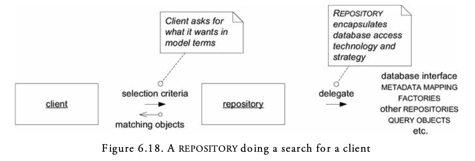

### Advantages of Repositories:

- They present clients with a simple model for obtaining persistent objects and managing their life cycle.
- They decouple application and domain design from persistence technology, multiple database strategies, or even multiple data sources.
- They communicate design decisions about object access.
- They allow easy substitution of a dummy implementation, for use in testing (typically using an in- memory collection).

**TODO: Research further into later. (Currently not relevant)**

# Using the Language: An Extended Example

In order to implement a domain driven model to an existing application, we would do as follows;

## Isolate the Domain

To prevent responsibilties being mixed, we apply the layered archiecture to mark off a domain layer.
E.g. A cargo management system would have;

1. A Tracking Query that can access past and present handling of a particular Cargo
2. A Booking Application that allows a new Cargo to be registered and prepares the system for it
3. An Incident Logging Application that can record each handling of the Cargo (providing the information that is found by the Tracking Query)

## Distinguish Entities and Value Objects

Anything not interchangeable is an Entity

E.g. Customers, Cargo, Handling Events, Delivery History and Carrier Movement.

Otherwise they are treated as Value Objects;

E.g. Deliery Specificiation, Roles, etc.

Below is a distiction of problematic assocations;

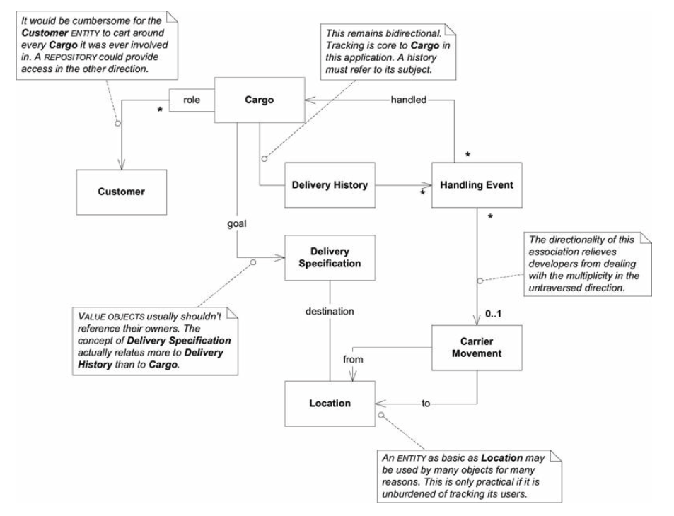

## Aggregate Boundries

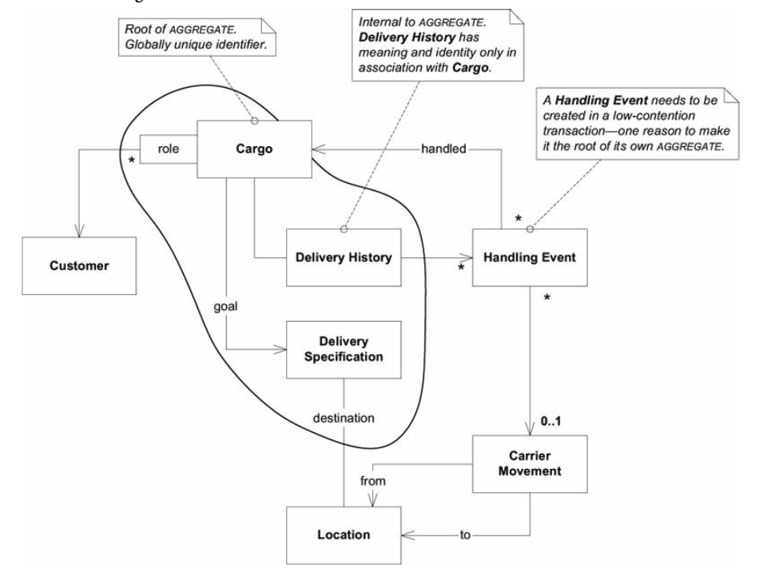

## Selecting Repositories

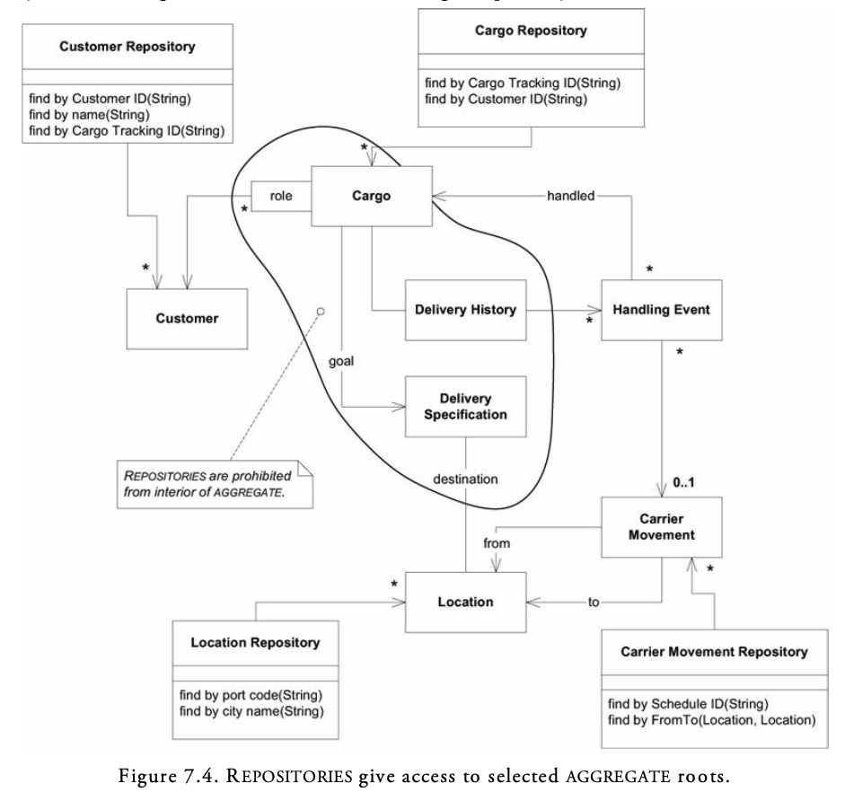

## Modules in the Shipping Model

The following diagram is a variation of an infrastructure-driven packaging problem when grouped in a pattern that doesn't convey the application story;

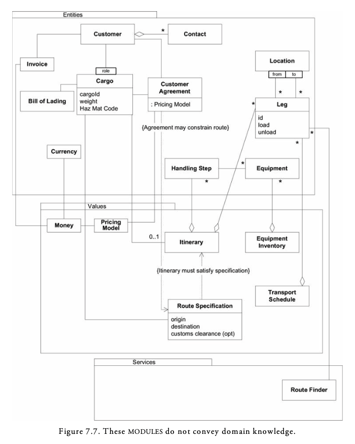

While a domain driven one is more straight-forward;

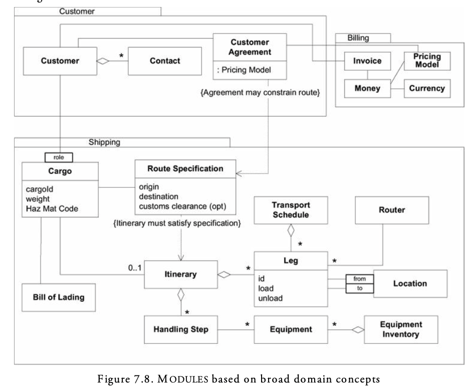

**TODO: Look into Anti Corruption Layer, and Enterprise Segments**

# Refactoring Toward Deeper Insight

Developing useful models successfully has three points;

1. Sophisticated domain models are achievable and worth the trouble.
2. They are seldom developed except through an iterative process of refactoring, including close involvement of the domain experts with developers interested in learning about the domain.
3. They may call for sophisticated design skills to implement and to use effectively.

## Levels of Refactoring

Refactoring is making continuous, small design changes that do not change functionality.  
Technical refactoring focuses on mechanical changes to make code more readable, or enhance at a detailed level.  
Refactoring to patterns are opportunities to apply established design patterns.  

Refactoring based on domain is not only micro refactors, but toward an insightful model.

## Opportunties

When a breakthrough to a deeper model emerges, it has higher opportunity and risk, and may be at an inopportune time, but is important for progress.

## Focus on Basics

Rather than trying to bring a breakthrough, the possibility comes after many refactorings. Emerging after each successful refinement.

# Making Implicit Concepts Explicit

## Digging Out Concepts

> Listen to the language the domain experts use. Are there terms that succinctly state something complicated? Are they correcting your word choice (perhaps diplomatically)? Do the puzzled looks on their faces go away when you use a particular phrase? These are hints of a concept that might benefit the model.

These concepts may not always be `nouns as objects`. When the users or domain experts use vocabulary that is nowhere in the design, that is a warning sign. It is a doubly strong warning when both the developers and the domain experts are using terms that are not in the design.

## Scrutinize Awkwardness

Sometimes we may not find these concepts easily, so we need to dig in awkward parts of our design, procedures that do complicated things that are hard to explain, or where new requirements add complexity.  
Sometimes it can be hard to recognize that there even is a missing concept. You may have objects doing all the work but find some of the responsibilities awkward. Or, if you do realize something is missing, a model solution may elude you.  

## Contemplate Contradictions

Different domain experts see things different ways based on their experience and needs. Even the same person provides information that is logically inconsistent after careful analysis.  
Such pesky contradictions, which we encounter all the time when digging into program requirements, can be great clues to deeper models. Some are just variations in terminology or are based on misunderstanding. But there is a residue where two factual statements by experts seem to contradict.  

> Reading a book about the domain subject can help grasp fundamental concepts that can enrich your model.

>  Experimentation is the way to learn what works and doesn’t. Trying to avoid missteps in design will result in a lower quality result because it will be based on less experience. And it can easily take longer than a series of quick experiments.

## Modeling Less Obvious Concepts

The object-oriented paradigm leads us to look for and invent certain kinds of concepts. Things, even very abstract ones, are the meat of most object models, along with the actions those things take. These are the “nouns and verbs” that introductory object-oriented design books talk about. But other important categories of concepts can be made explicit in a model as well.

### Explicit Constraints

Concepts can appear implicitly. E.g A bucket can only handle up to its capacity.  
Expressing it explicitly can make this more obvious rather than being buried as classes get more complicated.  

```java
// Not explicit

class Bucket {
   private float capacity;
   private float contents;
   public void pourIn(float addedVolume) {
      if (contents + addedVolume > capacity) {
         contents = capacity;
      } else {
         contents = contents + addedVolume;
      }
} }

// Explicit
class Bucket {
   private float capacity;
   private float contents;
   public void pourIn(float addedVolume) {
      float volumePresent = contents + addedVolume;
      contents = constrainedToCapacity(volumePresent);
   }
   private float constrainedToCapacity(float volumePlacedIn) {
      if (volumePlacedIn > capacity) return capacity;
      return volumePlacedIn;
   } 
}
```

This separate method gives the constraint some room to grow, but there are lots of cases when a constraint just can’t fit comfortably in a single method.  
Or even if the method stays simple, it may call on information that the object doesn’t need for its primary responsibility.  

Here are some warning signs that a constraint is distorting the design of its host object.  
- Evaluating a constraint requires data that does not otherwise fit the object’s definition.
- Related rules appear in multiple objects, forcing duplication or inheritance between objects that are not otherwise a family.
- A lot of design and requirements conversation revolves around the constraints, but in the implementation, they are hidden away in procedural code.

> When the constraints are obscuring the object’s basic responsibility, or when the constraint is prominent in the domain yet not prominent in the model, you can factor it out into an explicit object or even model it as a set of objects and relationships.

### Processes as Domain Objects

Procedures should not be the prominent aspect of our models. Objects are meant to encapsulate the procedures and let us think about their goals or intentions instead.  
A Service is one way of expressing a process explicitly, while encapsulating complex algorithms.

When there is more than one way to carry out a process, another approach is to make the algorithm itself, or some key part of it, an object in its own right. The choice between processes becomes a choice between these objects, each of which represents a different Strategy.

### Specification

A Specification states a constraint on the state of another object, which may or may not be present. It has multiple uses, but one that conveys the most basic concept is that a Specification can test any object to see if it satisfies the specified criteria.

> Create explicit predicate-like VALUE OBJECTS for specialized purposes. A SPECIFICATION is a predicate that determines if an object does or does not satisfy some criteria.

Uses for Specification objects.
- To validate an object to see if it fulfills some need or is ready for some purpose
- To select an object from a collection (as in the case of querying for overdue invoices) 
- To specify the creation of a new object to fit some need

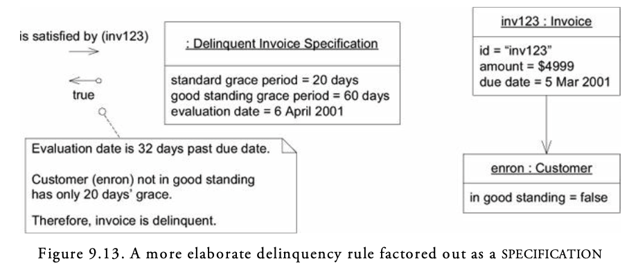

**TODO: More information on Applying and Implementing SPECIFICATION in Page 169 of DDD**

# Supple Design

Software is built to serve users, but it is also to serve developers as well. Developers might take two roles, creating a system or using it, sometimes switching between the two.

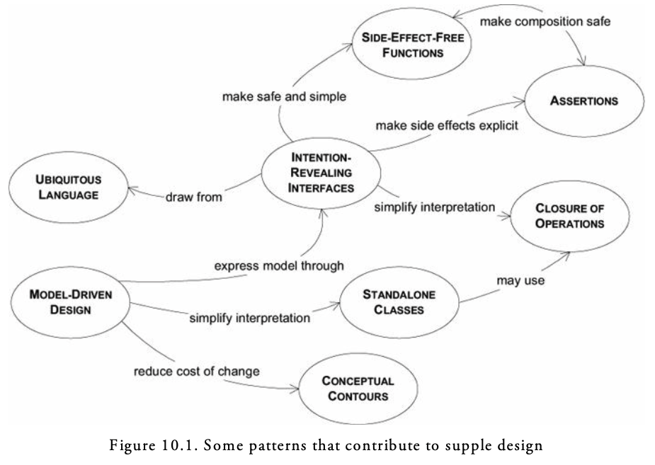

## Intention-Revealing Interfaces

> If a developer must consider the implementation of a component in order to use it, the value of encapsulation is lost. If someone other than the original developer must infer the purpose of an object or operation based on its implementation, that new developer may infer a purpose that the operation or class fulfills only by chance. If that was not the intent, the code may work for the moment, but the conceptual basis of the design will have been corrupted, and the two developers will be working at cross-purposes.

> Name classes and operations to describe their effect and purpose, without reference to the means by which they do what they promise.

Names should conform to the modeling language we built, mentioned across the previous chapters.

> Write a test for a behavior before creating it, to force your thinking into client developer mode.

## Side-Effect-Free Functions

Operations can be broadly divided into two categories, commands and queries.

- Queries obtain information from a system, possibly by simply accessing data in a variable, possibly performing a calculation based on that data.
- Commands (also known as modifiers) are operations that affect some change to the systems (for a simple example, by setting a variable).

> Interactions of multiple rules or compositions of calculations become extremely difficult to predict. The developer calling an operation must understand its implementation and the implementation of all its delegations in order to anticipate the result.
> The usefulness of any abstraction of interfaces is limited if the developers are forced to pierce the veil.

Operations that return results without producing side effects are called functions.  
A function can be called multiple times and return the same value each time.  
A function can call on other functions without worrying about the depth of nesting. Functions are much easier to test than operations that have side effects. For these reasons, functions lower risk.  

Obviously, you can’t avoid commands in most software systems, but the problem can be mitigated in two ways. First, you can keep the commands and queries strictly segregated in different operations. Ensure that the methods that cause changes do not return domain data and are kept as simple as possible.  

Second, there are often alternative models and designs that do not call for an existing object to be modified at all. Instead, a new Value Object, representing the result of the computation, is created and returned. A Value Object can be created in answer to a query, handed off, and forgotten—unlike an Entity, whose life cycle is carefully regulated.  

Value Objects are immutable, which implies that, apart from initializers called only during creation, all their operations are functions.  

## Assertions

> When the side effects of operations are only defined implicitly by their implementation, designs with a lot of delegation become a tangle of cause and effect. The only way to understand a program is to trace execution through branching paths. The value of encapsulation is lost. The necessity of tracing concrete execution defeats abstraction.  

> State post-conditions of operations and invariants of classes and Aggregates. If Assertions cannot be coded directly in your programming language, write automated unit tests for them. Write them into documentation or diagrams where it fits the style of the project’s development process.  

> Seek models with coherent sets of concepts, which lead a developer to infer the intended Assertions, accelerating the learning curve and reducing the risk of contradictory code.  

## Conceptual Contours

> Decompose design elements (operations, interfaces, classes, and Aggregates) into cohesive units, taking into consideration your intuition of the important divisions in the domain.

## Standalone classes

> Low coupling is fundamental to object design. When you can, go all the way. Eliminate all other concepts from the picture. Then the class will be completely self-contained and can be studied and understood alone. Every such self-contained class significantly eases the burden of understanding a Module.

## Closure of Operations

> Where it fits, define an operation whose return type is the same as the type of its argument(s). If the implementer has state that is used in the computation, then the implementer is effectively an argument of the operation, so the argument(s) and return value should be of the same type as the implementer. Such an operation is closed under the set of instances of that type. A closed operation provides a high-level interface without introducing any dependency on other concepts.

## Declarative Design

**TODO: More about declaritive design in Specifications on Page 199 of DDD**

## Angles of Attack

### Carve Off Subdomains

To make a system supple, pick some aspects of the system to be separated into a model or simple framework that allows us to declare rules. With each step, not only is the module clean, but the part left behind is smaller and cleaner.  

### Draw on Established Formalisms, When You Can

Creating a tight conceptual framework from scratch is something you can’t do every day. But you can often use and adapt conceptual systems that are long established in your domain or others.  
Many business applications involve accounting, for example. Accounting defines a well- developed set of ENTITIES and rules that make for an easy adaptation to a deep model and a supple design.  

Another good example is math. Many domains include math somewhere. Look for it. Dig it out. Specialized math is clean, combinable by clear rules, and people find it easy to understand.  

# Applying Analysis Patterns

> Analysis patterns are groups of concepts that represent a common construction in business modeling. It may be relevant to only one domain or it may span many domains. [Fowler 1997, p. 8, Analysis Patterns: Reusable Object Models]

# Relating Design Patterns to the Model

> Point of view affects one’s interpretation of what is and isn’t a pattern. One person’s pattern can be another person’s primitive building block.

## Strategy (a.k.a. Policy)

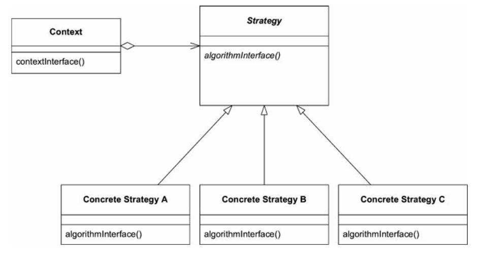

> Define a family of algorithms, encapsulate each one, and make them interchangeable. Strategy lets the algorithm vary independently from clients that use it.

> Domain models contain processes that are not technically motivated but actually meaningful in the problem domain. When alternative processes must be provided, the complexity of choosing the appropriate process combines with the complexity of the multiple processes themselves, and things get out of hand.

> Factor the varying part of a process into a separate “strategy” object in the model. Factor apart a rule and the behavior it governs. Implement the rule or substitutable process following the Strategy design pattern. Multiple versions of the strategy object represent different ways the process can be done.

## Composite

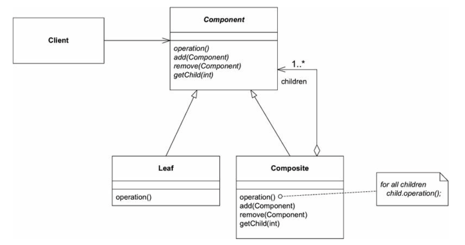

> Compose objects into tree structures to represent part-whole hierarchies. Composite lets clients treat individual objects and compositions of objects uniformly.

> Define an abstract type that encompasses all members of the Composite. Methods that return information are implemented on containers to return aggregated information about their contents. “Leaf” nodes implement those methods based on their own values. Clients deal with the abstract type and have no need to distinguish leaves from containers.

# Refactoring Toward Deeper Insight

Refactoring toward deeper insight is a multifaceted process. Seeking insight into the domain creates a broader context for the process of refactoring.  

## Initiation

Refactoring toward deeper insight can begin in many ways. It may be a response to a problem in the code— some complexity or awkwardness. Perhaps a concept is missing. Maybe some relationship is wrong. This same realization could come when the code looks tidy, if the language of the model seems disconnected from the domain experts, or if new requirements are not fitting in naturally.  
Seeing the trouble spot is often the hardest and most uncertain part. After that, developers can systematically seek out the elements of a new model. They can brainstorm with colleagues and domain experts on systematized knowledge written as analysis patterns or design patterns.

**TODO: More about building teams, prior art, etc. for modeling domain on Page 233**

## Timing

> If you wait until you can make a complete justification for a change, you’ve waited too long.

Refactor when;
- The design does not express the team’s current understanding of the domain;
- Important concepts are implicit in the design (and you see a way to make them explicit); or
- You see an opportunity to make some important part of the design suppler.

*Don’t be absolute about things, but push beyond the comfort zone in the direction of favoring refactoring.*

# Maintaining Model Integrity

On large scale, or legacy projects, models follow their own internal logic and meaning. A "charge" model could mean something entirely different for a current feature compared to existing code.
**Bounded Contexts** defines the range of applicability of each model, while **Context Maps** gives a global overview of the project's contexts and the relationships between them.

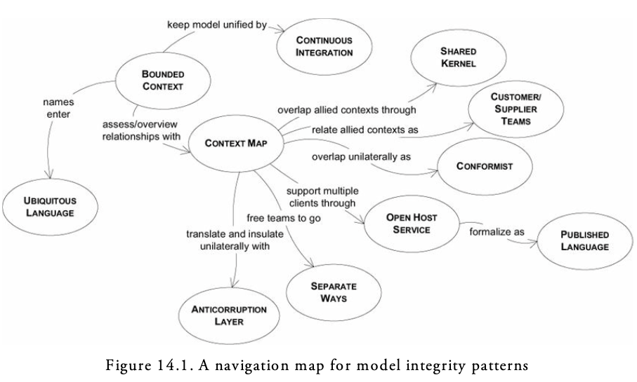

## Bounded Context

> Multiple models are in play on any large project. Yet when code based on distinct models is combined, software becomes buggy, unreliable, and difficult to understand. Communication among team members becomes confused. It is often unclear in what context a model should not be applied.

> Explicitly define the context within which a model applies. Explicitly set boundaries in terms of team organization, usage within specific parts of the application, and physical manifestations such as code bases and database schemas. Keep the model strictly consistent within these bounds, but don’t be distracted or confused by issues outside.

## Recognizing Splinters Within a Bounded Context

When coded interfaces don't match up, or unexpected behavior is a likely sign of unrecogized model differences.  
Combining elements of distinct models causes two categories of problems: duplicate concepts and false cognates.  

Duplication of concepts means that there are two model elements (and attendant implementations) that actually represent the same concept.
False cognates is when two people who are using the same term (or implemented object) think they are talking about the same thing, but are not.

## Continous Integration

When a number of people are working in the same Bounded Context, there is a strong tendency for the model to fragment. The bigger the team, the bigger the problem, but as few as three or four people can encounter serious problems. Yet breaking down the system into ever-smaller Context eventually loses a valuable level of integration and coherency.

Continous Integration means that all work within the context is being merged and made consistent frequently enough that when splinters happen they are caught and corrected quickly. Continous Integration, operates at two levels:

1. The integration of model concepts
2. The integration of the implementation

## Context Map

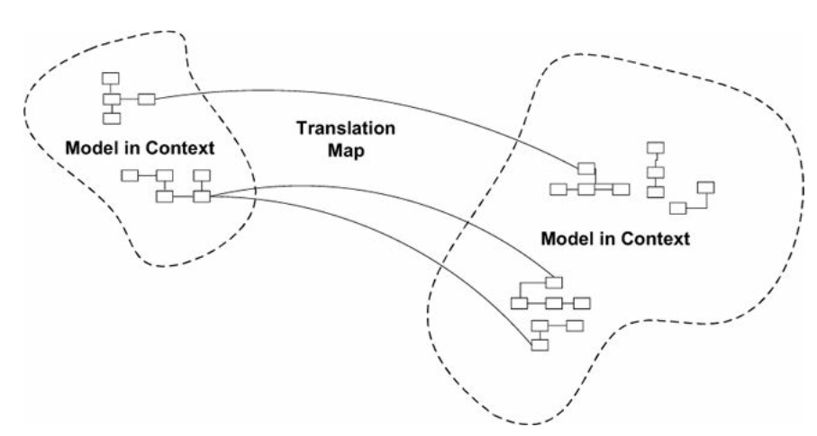


## Shared Kernel

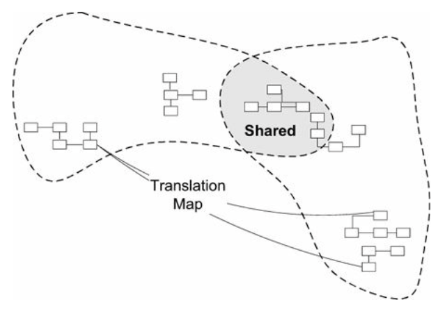

> Uncoordinated teams working on closely related applications can go racing forward for a while, but what they produce may not fit together. They can end up spending more on translation layers and retrofitting than they would have on Continuous Integration in the first place, meanwhile duplicating effort and losing the benefits of a common UBIQUITOUS LANGUAGE.

> Designate some subset of the domain model that the two teams agree to share. Of course this includes, along with this subset of the model, the subset of code or of the database design associated with that part of the model. This explicitly shared stuff has special status, and shouldn’t be changed without consultation with the other team.

Merges on separate teams happens daily, while kernel integrations happen maybe weekly.

## Customer/Supplier Development Teams

Often one subsystem essentially feeds another; the “downstream” component performs analysis or other functions that feed back very little into the “upstream” component, and all dependencies go one way.

Upstream and downstream subsystems separate naturally into two Bounded Contexts.

> Establish a clear customer/supplier relationship between the two teams. In planning sessions, make the downstream team play the customer role to the upstream team. Negotiate and budget tasks for downstream requirements so that everyone understands the commitment and schedule.

> Jointly develop automated acceptance tests that will validate the interface expected. Add these tests to the upstream team’s test suite, to be run as part of its continuous integration. This testing will free the upstream team to make changes without fear of side effects downstream.

There are two crucial elements to this pattern.
- The relationship must be that of customer and supplier, with the implication that the customer’s needs are paramount. Because the downstream team is not the only customer, the different customers’ demands have to be balanced in negotiation—but they remain priorities. This situation is in contrast to the poor-cousin relationship that often emerges, in which the downstream team has to come begging to the upstream team for its needs.

- There must be an automated test suite that allows the upstream team to change its code without fear of breaking the downstream, and lets the downstream team concentrate on its own work without constantly monitoring the upstream team.

## Conformist

> When using an off-the-shelf component that has a large interface, you should typically Conform to the model implicit in that component. Because the component and the application are clearly different Bounded Contexts, based on team organization and control, adapters may be needed for minor format changes, but the model should be equivalent. Otherwise, you should question the value of having the component. If it is good enough to give you value, there is probably knowledge crunched into its design. Within its narrow sphere, it may well be much more advanced than your own understanding. Your model presumably extends beyond the scope of this component, and your own concepts will evolve for those other parts. But where they connect, your model is a Conformist, following the lead of the component’s model. In effect, you could be dragged into a better design.


Eliminate the complexity of translation between Bounded Contexts by slavishly adhering to the model of the upstream team. Although this cramps the style of the downstream designers and probably does not yield the ideal model for the application, choosing Conformity enormously simplifies integration. Also, you will share a UBIQUITOUS LANGUAGE with your supplier team. The supplier is in the driver’s seat, so it is good to make communication easy for them. Altruism may be sufficient to get them to share information with you.

## Anticorruption Layer

> When a new system is being built that must have a large interface with another, the difficulty of relating the two models can eventually overwhelm the intent of the new model altogether, causing it to be modified to resemble the other system’s model, in an ad hoc fashion. The models of legacy systems are usually weak, and even the exception that is well developed may not fit the needs of the current project. Yet there may be a lot of value in the integration, and sometimes it is an absolute requirement.

> Create an isolating layer to provide clients with functionality in terms of their own domain model. The layer talks to the other system through its existing interface, requiring little or no modification to the other system. Internally, the layer translates in both directions as necessary between the two models.

### Designing the Interface of the Anticorruption Layer

The public interface of the Anticorruption layer usually appears as a set of Services, althrough occasionally it can take the form of an Entity.

### Implementing the Anticorruption Layer

One way of organizing the design of the Anticorruption Layer is as a combination of Facades, Adapters, and translators.

A Facade is an alternative interface for a subsystem that simplifies access for the client and makes the subsystem easier to use.
Because we know exactly what functionality of the other system we want to use, we can create a FACADE that facilitates and streamlines access to those features and hides the rest. The Facade does not change the model of the underlying system. It should be written strictly in accordance with the other system’s model. Otherwise, you will at best diffuse responsibility for translation into multiple objects and overload the Facade and at worst end up creating yet another model, one that doesn’t belong to the other system or your own Bounded Context. The Facade belongs in the Bounded Context of the other system. It just presents a friendlier face specialized for your needs.

An Adapter is a wrapper that allows a client to use a different protocol than that understood by the implementer of the behavior. When a client sends a message to an Adapter, it is converted to a semantically equivalent message and sent on to the “adaptee.” The response is converted and passed back. 

For each Service we define, we need an Adapter that supports the Service’s interface and knows how to make equivalent requests of the other system or its Facade.

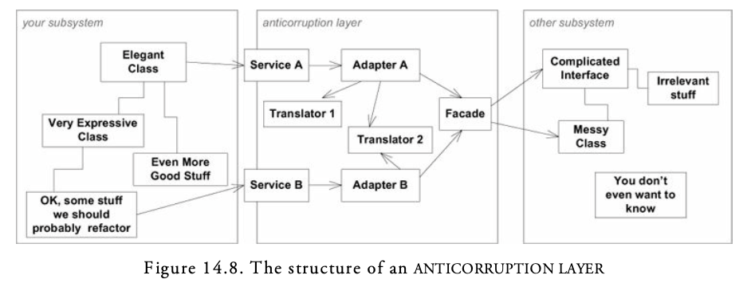

Note that building an Anticorruption Layer, especially with continous integration, and maybe even another sub-system comes with a cost.

## Separate Ways

Integration is always expensive. Sometimes the benefit is small.

> Declare a Bounded Context to have no connection to the others at all, allowing developers to find simple, specialized solutions within this small scope.

## Open Host Service

> Define a protocol that gives access to your subsystem as a set of Services. Open the protocol so that all who need to integrate with you can use it. Enhance and expand the protocol to handle new integration requirements, except when a single team has idiosyncratic needs. Then, use a one-off translator to augment the protocol for that special case so that the shared protocol can stay simple and coherent.

## Published Language

> Use a well-documented shared language that can express the necessary domain information as a common medium of communication, translating as necessary into and out of that language.

## Choosing Your Model Context Strategy

Always draw the Context Map to reflect the current situation at any given time. Now choose Context boundaries and relationships.

### Team Decision or Higher

First, teams have to make decisions about where to define Bounded Context and what sort of relationships to have between them.

### Putting Ourselves in Context

In a typical case, the system under design is going to get carved into one or two Bounded that the main development teams will be working on, perhaps with another Context or two in a supporting role. In addition to that are the relationships between these Contexts and the external systems.

### Transforming Boundaries

When drawing the boundries of Bounded Contexts;

Favoring Larger Bounded Contexts
• Flow between user tasks is smoother when more is handled with a unified model.
• It is easier to understand one coherent model than two distinct ones plus mappings. 
• Translation between two models can be difficult (sometimes impossible).
• Shared language fosters clear team communication.

Favoring Smaller Bounded Contexts
• Communication overhead between developers is reduced.
• CONTINUOUS INTEGRATION is easier with smaller teams and code bases.
• Larger contexts may call for more versatile abstract models, requiring skills that are in short supply.
• Different models can cater to special needs or encompass the jargon of specialized groups of users, along with specialized dialects of the UBIQUITOUS LANGUAGE.

### Accepting That Which We Cannot Change: Delineating the External Systems

It is best to start with the easiest decisions. Some subsystems will clearly not be in any Bounded Context for the system under development. Examples would be major legacy systems not immediately replaced, or external systems that provide services to us.

It is convenient to think of each of these systems as constituting its own Bounded Context, but most external systems only weakly meet the definition. First, a Bounded Context is defined by an intention to unify the model within certain boundaries. You may have control of maintenance of the legacy system, in which case you can declare the intention, or the legacy team may be well coordinated and be carrying out an informal form of Continous Integration.

### Relationships with the External Systems

There are three patterns that can apply here

- Separate Ways: 
If we don't need integration and gives the user easy access to both systems. Integration is expensive and distracting, but be cautious when deciding this option.  

- Conformist: 
Creativity and options would be limited. When deciding this pattern, we restrict ourselves to extension only, with no modification of the existing model. (such as large legacy systems)
If there is a discernable domain model behind the other system, you can improve your implementation by making that model more explicit than it was in the old system, just as long as you strictly conform to the old model.

- Anticorruption Layer:
When the functionality of the system under design is going to be more involved than an extension to an existing system, where your interface to the other system is small, or where the other system is very badly designed, you’ll really want your own Bounded Context, which means building a translation layer, or even an Anticorruption Layer.

### The System Under Design

As the team grows larger, CONTINUOUS INTEGRATION may become difficult. You may look for a SHARED KERNEL and break off relatively independent sets of functionality into separate BOUNDED CONTEXTS, each with fewer than ten people. If all of the dependencies between two of these go in one direction, you could set up CUSTOMER/SUPPLIER DEVELOPMENT TEAMS.

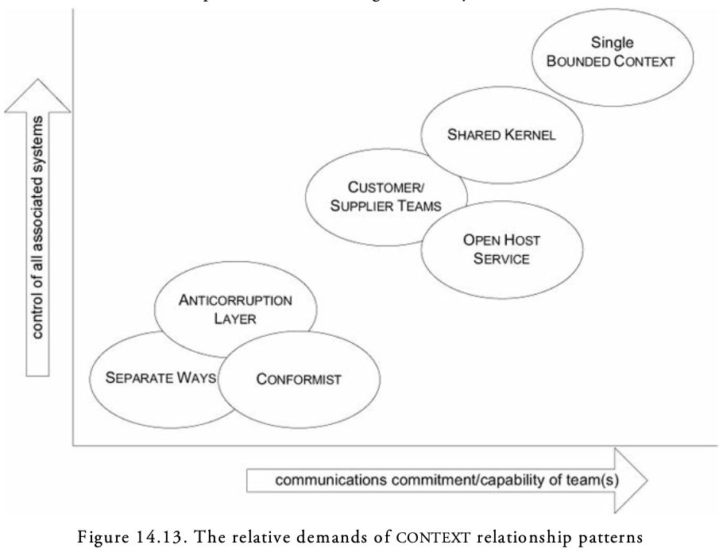

## Transformations

**TODO: Look into transforming patterns from one to another in Page 276**

### Phasing Out a Legacy System

In any given iteration:
1. Identify specific functionality of the legacy that could be added to one of the favored systems within a single iteration.
2. Identify additions that will be required in the ANTICORRUPTION LAYER. 
3. Implement.
4. Deploy.

Once running;

5. Identify any unnecessary parts of the ANTICORRUPTION LAYER and remove them.
6. Consider excising the now-unused modules of the legacy system, though this may not turn out to be practical. Ironically, the better designed the legacy system is, the easier it will be to phase it out. But badly designed software is hard to dismantle a little at a time. It may be possible to just ignore the unused parts until a later time when the remainder has been phased out and the whole thing can be switched off.

# Distillation

Distillation is the process of separating the components of a mixture to extract the essence in a form that makes it more valuable and useful. A model is a distillation of knowledge. With every refactoring to deeper insight, we abstract some crucial aspect of domain knowledge and priorities.

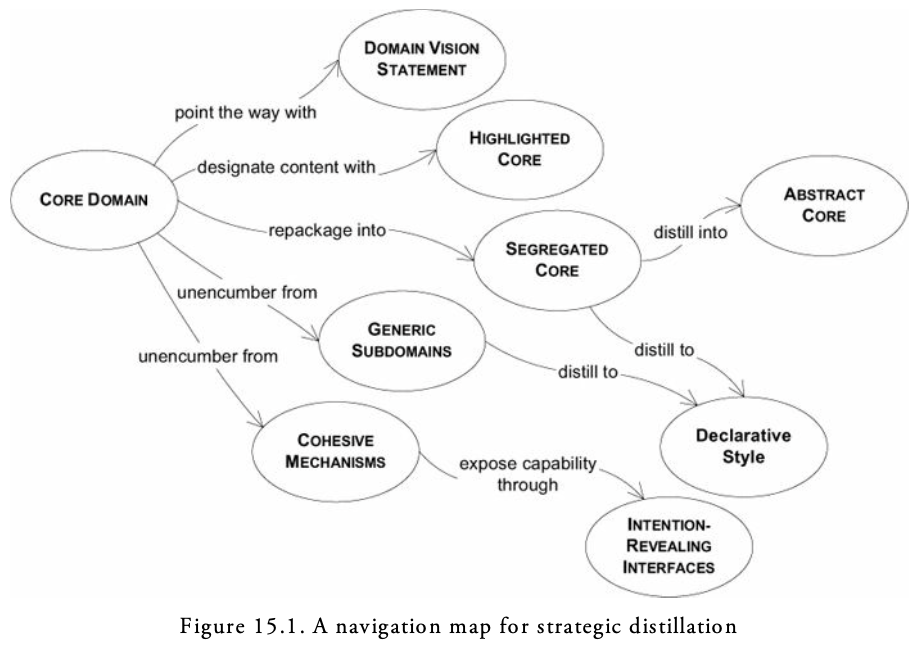

## Core Domain

A system that is hard to understand is hard to change, and hard to forsee its effects. When developers confine their work to specific modules, it further reduces knowledge transfer. With the compartmentalization of work, smooth integration of the system suffers, and flexibility in assigning work is lost. 

> The harsh reality is that not all parts of the design are going to be equally refined. Priorities must be set. To make the domain model an asset, the model’s critical core has to be sleek and fully leveraged to create application functionality.

> Boil the model down. Find the CORE DOMAIN and provide a means of easily distinguishing it from the mass of supporting model and code. Bring the most valuable and specialized concepts into sharp relief. Make the CORE small.

Distilling the CORE DOMAIN is not easy, but it does lead to some easy decisions. You’ll put a lot of effort into making your CORE distinctive, while keeping the rest of the design as generic as is practical. If you need to keep some aspect of your design secret as a competitive advantage, it is the CORE DOMAIN. There is no need to waste effort concealing the rest.


### Choosing the CORE

One application’s CORE DOMAIN is another application’s generic supporting component. Still, throughout one project, and usually throughout one company, a consistent CORE can be defined. Like every other part of the design, the identification of the CORE DOMAIN should evolve through iterations. The importance of a particular set of relationships might not be apparent at first. The objects that seem obviously central at first may turn out to have supporting roles.

There is a more fundamental reason for caution: The greatest value of custom software comes from the total control of the CORE DOMAIN. A well-designed framework may be able to provide high-level abstractions that you can specialize for your use. It may save you from developing the more generic parts and leave you free to concentrate on the CORE. But if it constrains you more than that, then there are three likely possibilities.

1. You are losing an essential software asset. Back off restrictive frameworks in your CORE DOMAIN
2. The area treated by the framework is not as pivotal as you thought. Redraw the boundaries of the CORE DOMAIN to the truly distinctive part of the model.
3. You don’t have special needs in your CORE DOMAIN. Consider a lower-risk solution, such as purchasing software to integrate with your applications.

### An Escalation of Distillations

A simple DOMAIN VISION STATEMENT communicates the basic concepts and their value with a minimum investment. The HIGHLIGHTED CORE can improve communication and help guide decision making—and still requires little or no modification to the design.

More aggressive refactoring and repackaging explicitly separate GENERIC SUBDOMAINS, which can then be dealt with individually. COHESIVE MECHANISMS can be encapsulated with versatile, communicative, and supple design. Removing these distractions disentangles the CORE.

Repackaging a SEGREGATED CORE makes the CORE directly visible, even in the code, and facilitates future work on the CORE model.

And most ambitious is the ABSTRACT CORE, which expresses the most fundamental concepts and relationships in a pure form (and requires extensive reorganizing and refactoring of the model).

### Generic Subdomains

Some parts of the model add complexity without capturing or communicating specialized knowledge. Anything extraneous makes the CORE DOMAIN harder to discern and understand. The model clogs up with general principles everyone knows or details that belong to specialties which are not your primary focus but play a supporting role. Yet, however generic, these other elements are essential to the functioning of the system and the full expression of the model. 

> Identify cohesive subdomains that are not the motivation for your project. Factor out generic models of these subdomains and place them in separate MODULES. Leave no trace of your specialties in them.
> Once they have been separated, give their continuing development lower priority than the CORE DOMAIN, and avoid assigning your core developers to the tasks (because they will gain little domain knowledge from them). Also consider off-the-shelf solutions or published models for these GENERIC SUBDOMAINS.

#### Option 1: An Off-the-Shelf Solution

Advantages: 
- Less code to develop.
- Maintenance burden externalized.
- Code is probably more mature, used in multiple places, and therefore more bulletproof and complete than homegrown code.

Disadvantages:
- You still have to spend the time to evaluate it and understand it before using it.
- Quality control being what it is in our industry, you can’t count on it being correct and stable.
- It may be overengineered for your purposes; integration could be more work than a minimalist homegrown implementation.
- Foreign elements don’t usually integrate smoothly. There may be a distinct BOUNDED CONTEXT. Even if not, it may be difficult to smoothly reference ENTITIES from your other packages.
- It may introduce platform dependencies, compiler version dependencies, and so on.

#### Option 2: A Published Design or Model

Advantages:
- More mature than a homegrown model and reflects many people’s insights
- Instant, high-quality documentation

Disadvantage:
- May not quite fit your needs or may be overengineered for your needs

#### Option 3: An Outsourced Implementation

Advantages:
- Keeps core team free to work on the CORE DOMAIN, where most knowledge is needed and accumulated.
- Allows more development to be done without permanently enlarging the team, but without dissipating knowledge of the CORE DOMAIN.
- Forces an interface-oriented design, and helps keep the subdomain generic, because the specification is being passed outside.

Disadvantages:
- Still requires time from the core team, because the interface, coding standards, and any other important aspects need to be communicated.
- Incurs significant overhead of transferring ownership back inside, because code has to be understood. (Still, overhead is less than for specialized subdomains, because a generic model presumably requires no special background to understand.)
- Code quality can vary. This could be good or bad, depending on the relative caliber of the two teams.

Automated tests can play an important role in outsourcing. The implementers should be required to provide unit tests for the code they deliver. A really powerful approach—one that helps ensure a degree of quality, clarifies the spec, and smooths reintegration—is to specify or even write automated acceptance tests for the outsourced components. Also, “outsourced implementation” can be an excellent combination with “published design or model.”

#### Option 4: An In-House Implementation

Advantages:
- Easy integration.
- You get just what you want and nothing extra. 
- Temporary contractors can be assigned.

Disadvantages:
- Ongoing maintenance and training burden.
- It is easy to underestimate the time and cost of developing such packages.

GENERIC SUBDOMAINS are the place to try to apply outside design expertise, because they do not require deep understanding of your specialized CORE DOMAIN, and they do not present a major opportunity to learn that domain. Confidentiality is of less concern, because little proprietary information or business practice will be involved in such modules. A GENERIC SUBDOMAIN lessens the training burden for those not committed to deep knowledge of the domain.

### Generic Doesn’t Mean Reusable

Off-the-shelf solutions may or may not make sense for a particular situation, but assuming that you are implementing the code yourself, in-house or outsourced, you should specifically not concern yourself with the reusability of that code. This would go against the basic motivation of distillation: that you should be applying as much of your effort to the CORE DOMAIN as possible and investing in supporting GENERIC SUB-DOMAINS only as necessary.

Though you should seldom design for reusability, you must be strict about keeping within the generic concept.

Introducing industry-specific model elements will have two costs. First, it will impede future development. Although you need only a small part of the subdomain model now, your needs will grow. By introducing anything to the design that is not part of the concept, you make it much more difficult to expand the system cleanly without completely rebuilding the older part and redesigning the other modules that use it.

The second, and more important, reason is that those industry-specific concepts belong either in the CORE DOMAIN or in their own, more specialized, subdomains, and those specialized models are even more valuable than the generic ones.

### Project Risk Management

Agile processes typically call for managing risk by tackling the riskiest tasks early. This initial system often proves a technical architecture, and it is tempting to build a peripheral system that handles some supporting GENERIC SUBDOMAIN because these are usually easier to analyze. But be careful; this can defeat the purpose of risk management.

Projects face risk from both sides, with some projects having greater technical risks and others greater domain modeling risks. Therefore, except when the team has proven skills and the domain is very familiar, the first-cut system should be based on some part of the CORE DOMAIN, however simple. 

## Domain Vision Statement

At the beginning of a project, the model usually doesn’t even exist, yet the need to focus its development is already there. In later stages of development, there is a need for an explanation of the value of the system that does not require an in-depth study of the model. Also, the critical aspects of the domain model may span multiple BOUNDED CONTEXTS, but by definition these distinct models can’t be structured to show their common focus.  

Many project teams write “vision statements” for management. The best of these documents lay out the specific value the application will bring to the organization. Some mention the creation of the domain model as a strategic asset. Usually the vision statement document is abandoned after the project gets funding, and it is never used in the actual development process or even read by the technical staff.

A DOMAIN VISION STATEMENT is modeled after such documents, but it focuses on the nature of the domain model and used during all phases of development.

> Write a short description (about one page) of the CORE DOMAIN and the value it will bring, the “value proposition.” Ignore those aspects that do not distinguish this domain model from others. Show how the domain model serves and balances diverse interests. Keep it narrow. Write this statement early and revise it as you gain new insight.

## Highlighted Core

> Even though team members may know broadly what constitutes the CORE DOMAIN, different people won’t pick out quite the same elements, and even the same person won’t be consistent from one day to the next. The mental labor of constantly filtering the model to identify the key parts absorbs concentration better spent on design thinking, and it requires comprehensive knowledge of the model. The CORE DOMAIN must be made easier to see.

### The Distillation Document

It can be as simple as a list of the most essential conceptual objects. It can be a set of diagrams focused on those objects, showing their most critical relationships. It can walk through the fundamental interactions at an abstract level or by example. It can use UML class or sequence diagrams, nonstandard diagrams particular to the domain, carefully worded textual explanations, or combinations of these. 

A distillation document is not a complete design document. It is a minimalist entry point that delineates and explains the CORE and suggests reasons for closer scrutiny of particular pieces. 

Write a very brief document (three to seven sparse pages) that describes the CORE DOMAIN and the primary interactions among CORE elements.

All the usual risks of separate documents apply.
- The document may not be maintained.
- The document may not be read.
- By multiplying the information sources, the document may defeat its own purpose of cutting through complexity.

The best way to limit these risks is to be absolutely minimalist. Staying away from mundane detail and focusing on the central abstractions and their interactions allows the document to age more slowly, because this level of the model is usually more stable.

### The Flagged CORE

> (When presented with a large application/model) Flag each element of the CORE DOMAIN within the primary repository of the model, without particularly trying to elucidate its role. Make it effortless for a developer to know what is in or out of the CORE.

### The Distillation Document as Process Tool

> If the distillation document outlines the essentials of the CORE DOMAIN, then it serves as a practical indicator of the significance of a model change. When a model or code change affects the distillation document, it requires consultation with other team members. When the change is made, it requires immediate notification of all team members, and the dissemination of a new version of the document. Changes outside the CORE or to details not included in the distillation document can be integrated without consultation or notification and will be encountered by other members in the course of their work. Then the developers have the full autonomy that XP suggests.

## Cohesive Mechanisms

> Computations sometimes reach a level of complexity that begins to bloat the design. The conceptual “what” is swamped by the mechanistic “how.” A large number of methods that provide algorithms for resolving the problem obscure the methods that express the problem.

> Partition a conceptually COHESIVE MECHANISM into a separate lightweight framework. Particularly watch for formalisms or well-documented categories of algorithms. Expose the capabilities of the framework with an INTENTION-REVEALING INTERFACE. Now the other elements of the domain can focus on expressing the problem (“what”), delegating the intricacies of the solution (“how”) to the framework.

### GENERIC SUBDOMAIN Versus COHESIVE MECHANISM

The difference is the nature of the responsibility taken on. A GENERIC SUBDOMAIN is based on an expressive model that represents some aspect of how the team views the domain. In this it is no different than the CORE DOMAIN, just less central, less important, less specialized. A COHESIVE MECHANISM does not represent the domain; it solves some sticky computational problem posed by the expressive models.

A model proposes; a COHESIVE MECHANISM disposes.

### When a MECHANISM Is Part of the CORE DOMAIN

You almost always want to remove MECHANISMS from the CORE DOMAIN. The one exception is when a MECHANISM is itself proprietary and a key part of the value of the software. 
This is sometimes the case with highly specialized algorithms. For example, if one of the distinguishing features of a shipping logistics application were a particularly effective algorithm for working out schedules, that MECHANISM could be considered part of the conceptual CORE.

## Segregated Core

> Elements in the model may partially serve the CORE DOMAIN and partially play supporting roles. CORE elements may be tightly coupled to generic ones. The conceptual cohesion of the CORE may not be strong or visible. All this clutter and entanglement chokes the CORE. Designers can’t clearly see the most important relationships, leading to a weak design.

> Refactor the model to separate the CORE concepts from supporting players (including ill-defined ones) and strengthen the cohesion of the CORE while reducing its coupling to other code. Factor all generic or supporting elements into other objects and place them into other packages, even if this means refactoring the model in ways that separate highly coupled elements.

The steps needed to refactor to SEGREGATED CORE are typically something like these:

- Identify a CORE subdomain (possibly drawing from the distillation document).
- Move related classes to a new MODULE, named for the concept that relates them.
- Refactor code to sever data and functionality that are not directly expressions of the concept. Put the removed aspects into (possibly new) classes in other packages. Try to place them with conceptually related tasks, but don’t waste too much time being perfect. Keep focused on scrubbing the CORE subdomain and making the references from it to other packages explicit and self-explanatory.
- Refactor the newly SEGREGATED CORE MODULE to make its relationships and interactions simpler and more communicative, and to minimize and clarify its relationships with other MODULES. (This becomes an ongoing refactoring objective.)
- Repeat with another CORE subdomain until the SEGREGATED CORE is complete.

**TODO: Example on how to segregate a Core on page 300**

## Abstract Core

> Identify the most fundamental concepts in the model and factor them into distinct classes, abstract classes, or interfaces. Design this abstract model so that it expresses most of the interaction between significant components. Place this abstract overall model in its own MODULE, while the specialized, detailed implementation classes are left in their own MODULES defined by subdomain.

## Deep Models Distill

> Although a breakthrough to a deep model provides value anywhere it happens, it is in the CORE DOMAIN that it can change the trajectory of an entire project.

## Choosing Refactoring Targets

1. In a pain-driven refactoring, you look to see if the root involves the CORE DOMAIN or the relationship of the CORE to a supporting element. If it does, you bite the bullet and fix that first.
2. When you have the luxury of refactoring freely, you focus first on better factoring of the CORE DOMAIN, on improving the segregation of the CORE, and on purifying supporting subdomains to be GENERIC.

# Large-Scale Structure
