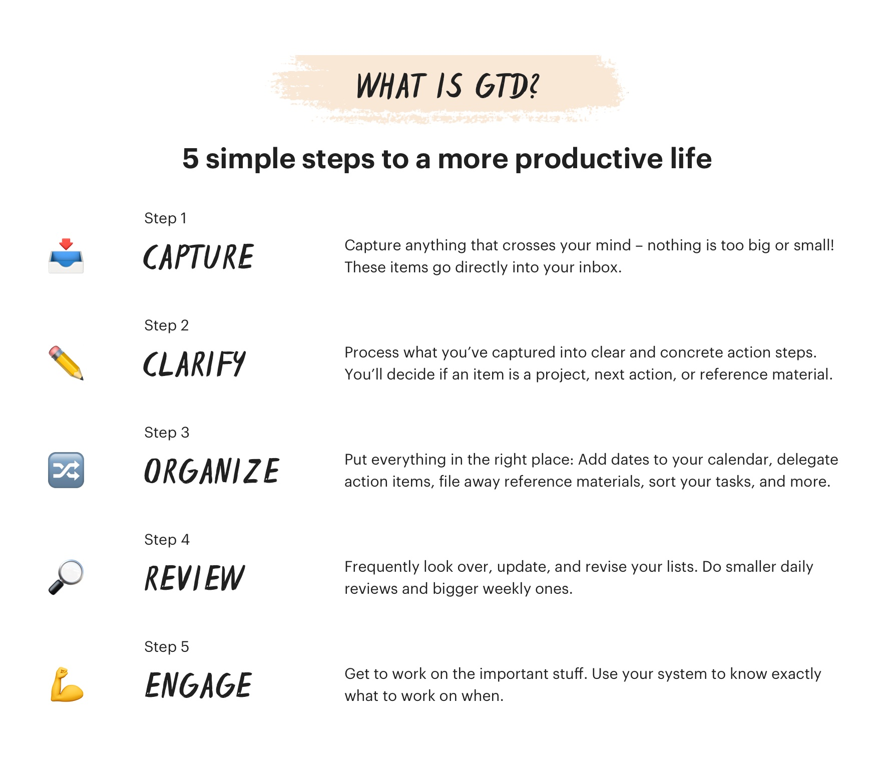
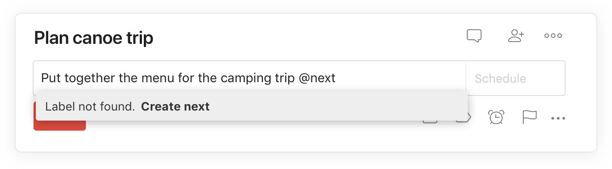

# Getting Things Done - Overview

## What is GTD?

## Capture

Anything that cross your mind - to-dos, events, ideas, book recommendations, etc. - must be captured and stored immediately in an inbox.  
Your inbox is a representation of all the inputs you need to somehow deal with on a daily basis.  

Your inbox is only used to collect the chaos of your thoughts in order to get them off your mind. This is not the place or time to worry about organization.  

## Clarify

Once all ideas are captured, we need to transform the chaotic clutter into actionable steps. Going through each item, we do the following;

- If the item will take less than 2 minutes, complete it right away.
- If it can be delegated, assign the task to someone else.
- If it's a non-actionable reference item (eg, a file, document, article, contact information etc.) that you'll need to come back to later, file it away in a separate reference project or attach it to the comments of the relevant task or project.
- If the item needs to be done at a specific date and/or time, give the task a due date.
- If the task is no longer needed or actionable, delete it.
- If a task requires more than one step, create a project to house all of the items associated with it and identify the one next action you can take to move the project forward.

We need to make tasks as specific and actionable as possible. Adding as much information to save time instead of puzzling over it later. E.g. “Call Mom” may actually need to be entered as “Call Mom to discuss birthday dinner.”

## Organize

After clarifying items, we need to sort it into an appropriate place.

### One-off tasks

These tasks take longer than 2 minutes but only require one step.  
As we don't want these cluttering up our inbox, and they don't belong to any other project, we can keep them in the "One-Off Tasks" project board.  

### Projects

Anything that requires more than two steps to are considered projects. Most action items are usually projects. For example, "paint the bedroom" is a project because it includes other tasks like getting paint samples, picking a color, buying supplies, prepping walls, etc.  

To handle projects;

- Create a new project for each multi-step project you identified as you were clarifying your tasks.  
- As you think of other steps, add them as new tasks inside the projects.

> Drag and drop the associated tasks from your Inbox to the appropriate project. Or click on a task and type "#" into the task field to pull up a list of your projects to choose from. (Todist)

## Areas of Focus

TODO: Look into later.
[Areas of Focus](https://todoist.com/productivity-methods/getting-things-done#areas-of-focus)

## Next Actions

These are tasks with a clear, concrete action you’ll do at the next opportunity (e.g. "Email James the budget for office party"). Next actions are separate from future actions — steps you'll take eventually but do not need your focus right now.

## Tasks with a due date and/or time

For items that must be completed at a specific date and/or time, schedule them. But be warned: GTD cautions against over-reliance on due dates. Only add them to the tasks that really have to be done on a given date and time. For everything else, trust your next actions and a regular weekly review of all your task lists (more on that later).  

## Agendas

TODO: Look into later.
[Agendas](https://todoist.com/productivity-methods/getting-things-done#agendas)  

## Reference materials

TODO: Look into later
[Reference Materials](https://todoist.com/productivity-methods/getting-things-done#reference-materials)  

## Waiting for

TODO: Look into later
[Waiting For](https://todoist.com/productivity-methods/getting-things-done#waiting-for)  

## Someday/Maybe

Many items that you capture will be ideas for things you want to do in the future, but don't have the bandwidth to work on now (e.g. places you may want to travel, books to read, new projects you may want to try, ideas for blog posts, etc.). You want to be able to review these later, but you don't want them gumming up your system now.  

- Create a new Someday/Maybe project
- Add all of the tasks and/or you want to do in the future, but aren't actively working on there
- (Optional) Add sub-projects for specific types of "Someday/Maybe" tasks. For example, you may want to separate Someday/Maybe — Personal and Someday/Maybe — Work projects
- Review your someday/maybe projects when time and energy open up to take on new work

## Tasks that can be delegated

TODO: Look into later
[Tasks that can be delegated](https://todoist.com/productivity-methods/getting-things-done#tasks-that-can-be-delegated)

## Contexts

TODO: Look into later
[Contexts](https://todoist.com/productivity-methods/getting-things-done#contexts)

TODO: More coming soon...
