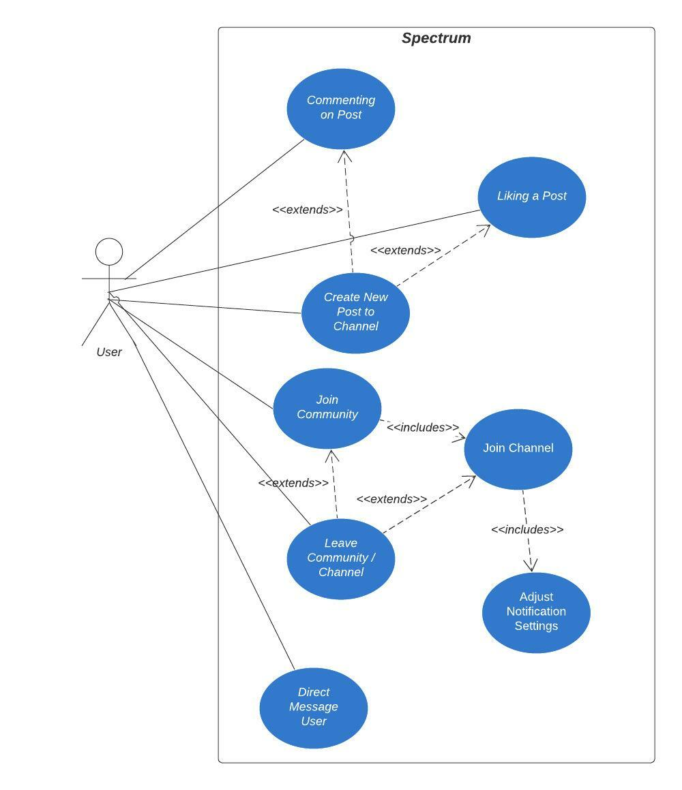

Spectrum is a platform where it combines the best of forums and real-time chat to form communities.

## Users

Below is a usecase diagram for a regular user using the application;

Users can join channels inside communities in order to chat with other users on the platform.

## Channels

What makes the chat feature in channels unique is the approach where chat messages function similarly to posts. Each chat message is its own thread in which users can like/comment on each chat message.

A **user** can join any number of **channels** or **communities** as they wish.

Each channel or community can have their own custom settings, E.g. A community can have a setting to have their login be announced with a message using the `brandedLogin` in the `communitySettings` model.

Communities have tighter control on who creates them and must be created through the GraphQL API.

While channels from within communities can be created by **moderators** of the community.
